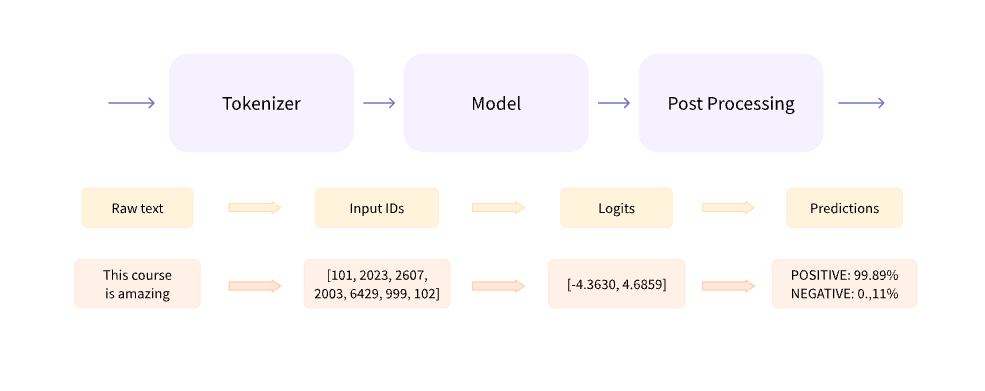

# Module 2 – Understanding the Transformer Pipeline

*Figure 1. End-to-end inference workflow in the Hugging Face `pipeline`: raw text is tokenized, processed by a Transformer model, and converted into human-readable predictions.*

This module explains how the Hugging Face `pipeline` API works internally by examining its core components: tokenizers, Transformer models, and inference workflows.

## Topics Covered

- Behind the pipeline
- Transformer models
- Tokenization
- Processing multiple sequences
- Building the complete inference pipeline

## Notebook

| Notebook | Description |
|----------|-------------|
| `02_pipeline_internals.ipynb` | Understanding the internal workflow of the Hugging Face Transformers pipeline. |

## Skills Demonstrated

- Hugging Face Transformers
- PyTorch
- Tokenization
- Model inference
- NLP preprocessing
- Pipeline internals

---

## Summary

This module provides a detailed look at the internal workflow of the Hugging Face `pipeline`, illustrating how tokenization, model inference, and post-processing work together to perform NLP tasks efficiently.