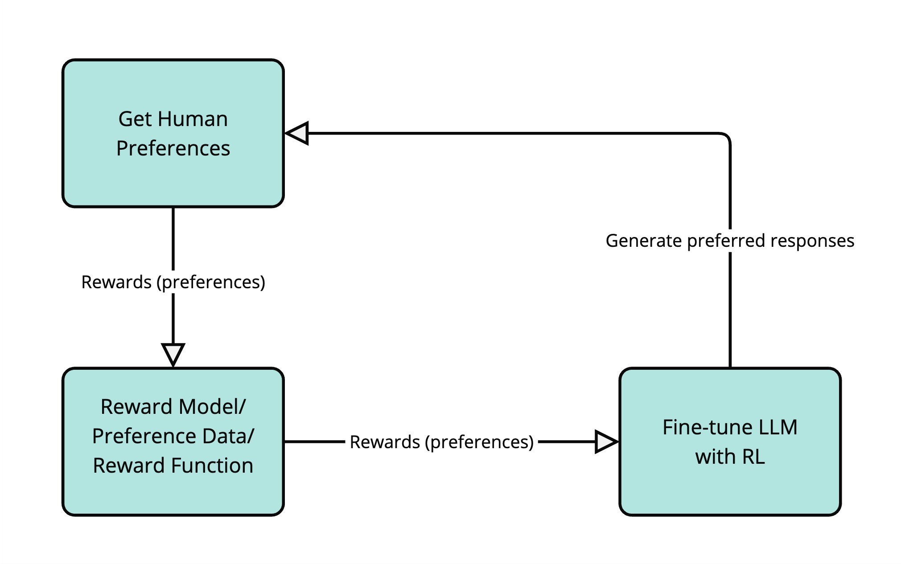
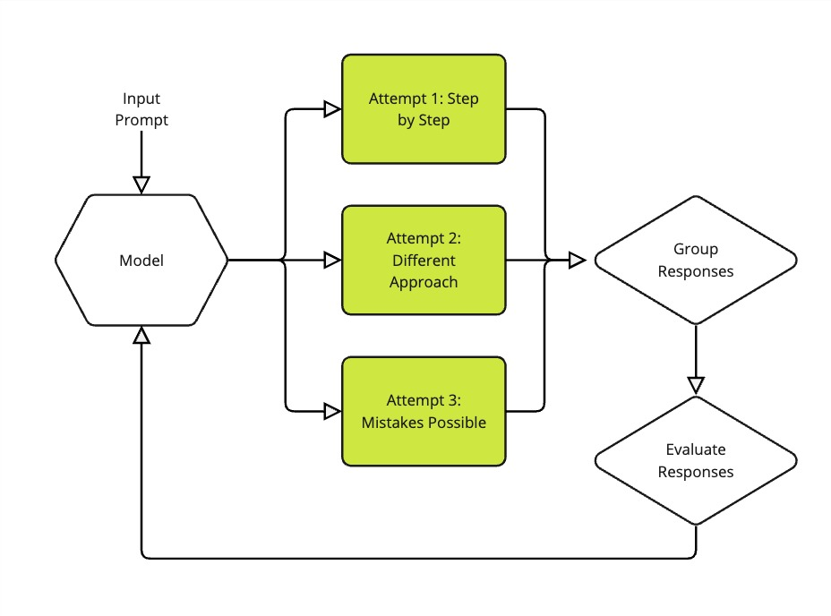
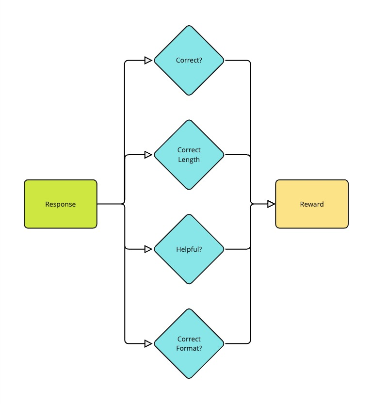

# Reasoning Large Language Models with GRPO (Group Relative Policy Optimization)

This project demonstrates how **Reasoning Large Language Models (Reasoning LLMs)** can be fine-tuned using **Group Relative Policy Optimization (GRPO)**, a reinforcement learning algorithm introduced by **DeepSeek R1**.

Unlike traditional supervised fine-tuning, GRPO teaches an LLM to improve its reasoning by generating **multiple candidate solutions**, evaluating them with **reward functions**, and reinforcing better reasoning paths through reinforcement learning. This notebook follows the practical workflow introduced in the Hugging Face **Open R1** course and implements GRPO using the **TRL** library. :contentReference[oaicite:0]{index=0}

---

# Motivation

Pretrained Large Language Models generate fluent text because they are optimized to predict the next token. However, they often struggle with problems requiring:

- Multi-step mathematical reasoning
- Logical reasoning
- Planning
- Self-correction
- Complex coding tasks

Recent reasoning models such as **DeepSeek R1** demonstrated that Reinforcement Learning can significantly improve reasoning capabilities after pretraining.

Instead of learning from labeled examples only, the model learns through **trial and error**, receiving rewards for producing better reasoning processes.

---

# What is Reinforcement Learning?

Reinforcement Learning (RL) trains an agent through interaction with an environment.

The basic RL loop consists of:

1. Observe the environment
2. Perform an action
3. Receive a reward
4. Improve the policy
5. Repeat

For language models:

- **Agent:** LLM
- **Environment:** Prompt and reward function
- **Action:** Generated response
- **Reward:** Quality score
- **Policy:** Model parameters

Rather than predicting only the next token, the model gradually learns to generate responses that maximize rewards.

---

# Reinforcement Learning from Human Feedback (RLHF)

One of the most successful approaches for aligning LLMs is **RLHF**.

The overall process is illustrated below.

<p align="center">

</p>

The workflow consists of four stages:

1. Human evaluators compare multiple responses.
2. Their preferences become reward signals.
3. A reward model (or reward function) learns these preferences.
4. Reinforcement learning updates the LLM to produce responses humans prefer.

This allows the model to become:

- More helpful
- More accurate
- Better aligned with human expectations
- Less likely to generate undesirable responses

---

# Why GRPO?

Several reinforcement learning algorithms have been proposed for LLM alignment.

| Method | Description |
|---------|-------------|
| PPO | Uses a policy model and a separate value model (critic). |
| DPO | Learns directly from preference pairs without reinforcement learning. |
| **GRPO** | Compares multiple responses within the same group and optimizes using relative rewards. |

GRPO offers several advantages:

- No separate value (critic) model
- Lower GPU memory requirements
- Stable optimization
- Better reasoning performance
- Flexible reward functions
- Simple implementation using Hugging Face TRL

---

# How GRPO Works

Instead of generating one answer, the model generates **multiple candidate solutions** for every prompt.

<p align="center">

</p>

The training process is:

### Step 1 — Generate Multiple Responses

Given a prompt:

> Solve 24 × 17

The model may generate several different reasoning paths.

Example:

- Step-by-step solution
- Shortcut calculation
- Incorrect reasoning
- Alternative approach

These responses form one **group**.

---

### Step 2 — Evaluate Each Response

Each response is evaluated using one or more reward functions.

Possible evaluation criteria include:

- Mathematical correctness
- Logical consistency
- Proper formatting
- Helpfulness
- Response length
- XML/JSON structure

Instead of comparing responses independently, GRPO compares them **relative to each other**.

Responses better than the group average receive positive advantages.

Poor responses receive negative advantages.

---

### Step 3 — Update the Model

The policy is updated so that:

- Good reasoning becomes more likely
- Poor reasoning becomes less likely

A KL-divergence penalty prevents the model from changing too aggressively, maintaining training stability.

---

# Reward Functions

The reward function is one of the most important components of GRPO.

<p align="center">

</p>

A reward function can evaluate multiple aspects simultaneously.

Examples include:

### ✔ Correctness

Did the model produce the correct answer?

Example:

```
24 × 17 = 408
```

Correct answer → reward = 1

Incorrect answer → reward = 0

---

### ✔ Formatting

Did the response follow the required format?

Example:

```
<think>
...
</think>

<answer>
...
</answer>
```

---

### ✔ Helpfulness

Does the reasoning clearly explain the solution?

---

### ✔ Response Length

Is the answer too short or unnecessarily long?

---

Multiple reward functions can be combined into a single reward score used during reinforcement learning.

---

# Group Relative Advantage

GRPO computes a **relative advantage** for each response:

```
Advantage =
(reward − mean(group rewards))
/
std(group rewards)
```

This means the model learns from **relative quality** rather than absolute scores.

Responses better than the average are reinforced.

Responses worse than average become less likely.

---

# DeepSeek R1 Training Pipeline

DeepSeek R1 was trained in several stages:

1. Cold Start Supervised Fine-Tuning
2. Reinforcement Learning for reasoning
3. Rejection Sampling
4. Diverse Reinforcement Learning

One of the most interesting discoveries during training was the **"Aha Moment"**, where the model spontaneously learned to:

- detect mistakes,
- reconsider intermediate reasoning,
- self-correct before producing a final answer.

---

# Notebook Contents

This notebook covers:

- Introduction to Reinforcement Learning
- Reinforcement Learning from Human Feedback (RLHF)
- DeepSeek R1
- Group Relative Policy Optimization (GRPO)
- Reward Functions
- TRL GRPOTrainer
- LoRA Fine-Tuning
- Fine-tuning SmolLM
- Weights & Biases experiment tracking
- Publishing models to Hugging Face Hub
- Text generation using the fine-tuned model

---

# Technologies Used

- Python
- PyTorch
- Hugging Face Transformers
- TRL
- PEFT (LoRA)
- Hugging Face Datasets
- Accelerate
- BitsAndBytes
- Flash Attention
- Weights & Biases

---

# Learning Outcomes

After completing this notebook you will understand how to:

- Explain Reinforcement Learning for LLMs.
- Understand the DeepSeek R1 training strategy.
- Implement GRPO using Hugging Face TRL.
- Design custom reward functions.
- Fine-tune LLMs using LoRA.
- Monitor reinforcement learning experiments.
- Publish trained models to the Hugging Face Hub.
- Generate text using a GRPO fine-tuned model.

---

# References

- Hugging Face Open R1 Course
- DeepSeek R1 Paper
- Hugging Face TRL Documentation
- Hugging Face Transformers Documentation